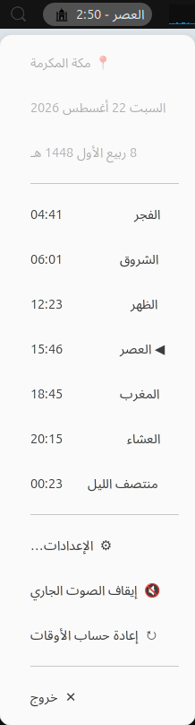
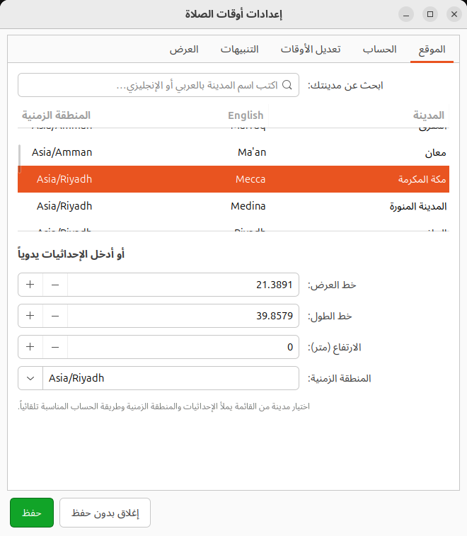
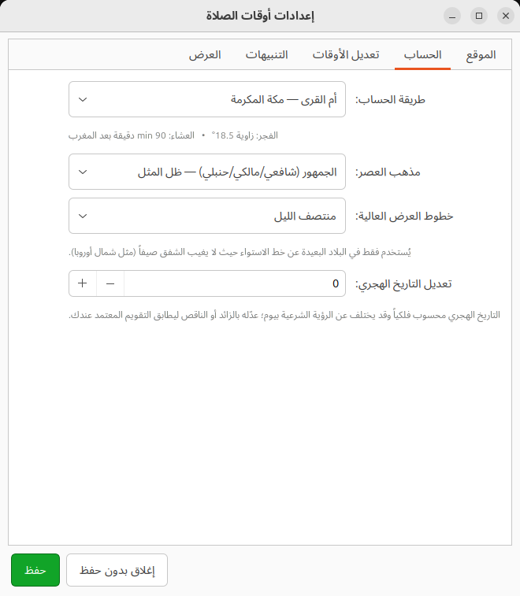
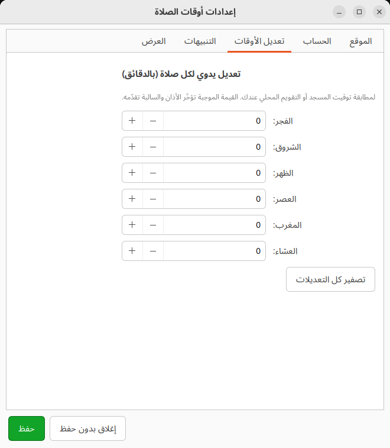
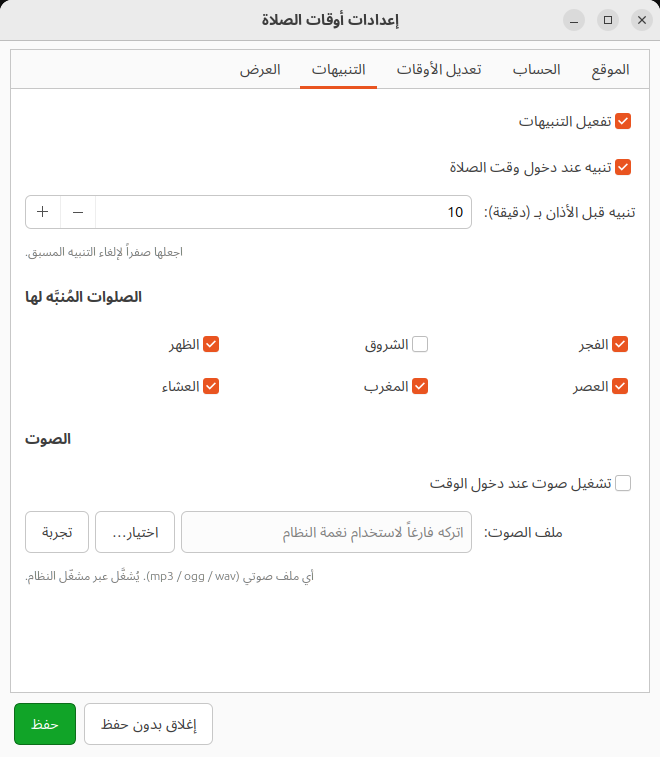
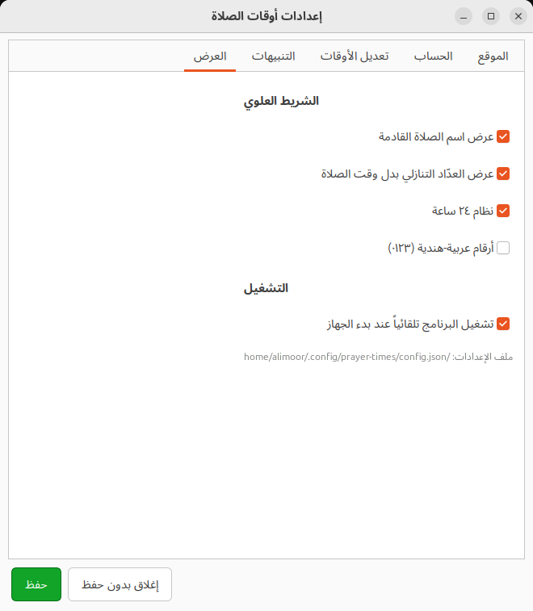

<div align="center">

# prayer-times-indicator

**Islamic prayer times in the Ubuntu top bar — computed offline, from the sun.**

The next prayer and a live countdown sit in your GNOME panel. Click it for the
full day's schedule, the Hijri date, and a complete settings panel.

[](https://github.com/MohammedAlimoor/prayer-times-indicator/actions/workflows/ci.yml)
[](https://github.com/MohammedAlimoor/prayer-times-indicator/releases/latest)
[](https://github.com/MohammedAlimoor/prayer-times-indicator/releases)
[](LICENSE)
[](#requirements)

<br>


<br><br>



</div>

---

## Why this one

| | |
|---|---|
| 🛰️ **No internet, ever** | Times come from a local astronomical calculation of the sun's position. No API, no account, no network call, no telemetry. It works on a laptop in airplane mode. |
| 🕰️ **Always visible** | The next prayer and the countdown live in the panel, not behind a notification you already dismissed. |
| 🎛️ **Tuned to your masjid** | 18 calculation methods, both Asr schools, and a per-prayer ±120 minute adjustment so the numbers match the board at your local mosque exactly. |
| 🪶 **Tiny** | Pure Python on the PyGObject bindings Ubuntu already ships. ~2000 lines, no pip dependencies, a 25 KB `.deb`. |
| 🇸🇦 **Arabic-first** | Right-to-left interface, Arabic city names, Hijri dates, and optional Arabic-Indic numerals. |

> **Note on language:** the program's interface is in Arabic — that is its audience.
> This README, the code layout, and the packaging are in English.

---

## Download

Direct downloads, always pointing at the newest release:

| | |
|---|---|
| 📦 **Debian package** (recommended) | [**prayer-times-indicator.deb**](https://github.com/MohammedAlimoor/prayer-times-indicator/releases/latest/download/prayer-times-indicator.deb) |
| 🗜️ **Source tarball** | [**prayer-times-indicator.tar.gz**](https://github.com/MohammedAlimoor/prayer-times-indicator/releases/latest/download/prayer-times-indicator.tar.gz) |
| 🔐 **Checksums** | [SHA256SUMS](https://github.com/MohammedAlimoor/prayer-times-indicator/releases/latest/download/SHA256SUMS) |

Every release is [built, installed and smoke-tested by GitHub Actions](.github/workflows/release.yml)
on a clean Ubuntu 24.04 runner before it is published.

### Install the `.deb`

```bash
wget https://github.com/MohammedAlimoor/prayer-times-indicator/releases/latest/download/prayer-times-indicator.deb
sudo apt install ./prayer-times-indicator.deb
prayer-times
```

`apt` pulls in the GTK and AppIndicator bindings for you. To remove it:

```bash
sudo apt remove prayer-times-indicator
```

### Or install from source, no root needed

```bash
git clone https://github.com/MohammedAlimoor/prayer-times-indicator.git
cd prayer-times-indicator
./install.sh          # installs under ~/.local, no sudo
prayer-times
```

`./uninstall.sh` removes it again; add `--purge` to drop your settings too.

### Or just run it

```bash
python3 run.py
```

**On first launch** the setup window opens. Pick your city and calculation
method, press **حفظ** (Save), and the indicator appears immediately. Your
settings are remembered and reloaded on every later start; change them any
time from **the icon's menu → الإعدادات…**

---

## What it does

- **Panel label** — the next prayer with a live countdown (`العصر - 2:48`), or the
  clock time instead, in 12- or 24-hour form, in Latin or Arabic-Indic digits.
- **The full day** at a glance: Fajr, Sunrise, Dhuhr, Asr, Maghrib, Isha, plus
  midnight — with the current prayer marked.
- **Hijri and Gregorian dates**, both written out in Arabic.
- **Notifications** a configurable number of minutes before the adhan, and again
  when the time enters — per prayer, so you can silence Sunrise and keep the rest.
- **Adhan sound** from any `mp3`/`ogg`/`wav` file you point it at, played through
  whichever system player is available, with a *stop the sound* item in the menu.
- **Autostart** on login, managed from the settings panel (it writes and removes
  `~/.config/autostart/prayer-times.desktop` for you).
- **130+ built-in cities** searchable in Arabic or English, with fuzzy matching
  that ignores diacritics and hamza forms — or enter coordinates by hand.

---

## Screenshots

<table>
<tr>
<td width="50%"><br><b>Location</b> — search 130+ cities in either language, or type coordinates, elevation and timezone yourself.</td>
<td width="50%"><br><b>Calculation</b> — 18 methods, the two Asr schools, high-latitude handling, and a Hijri date nudge.</td>
</tr>
<tr>
<td width="50%"><br><b>Adjustments</b> — shift any prayer by ±120 minutes to match your local mosque exactly.</td>
<td width="50%"><br><b>Alerts</b> — pre-adhan warning, on-time notification, per-prayer selection, and your own adhan file.</td>
</tr>
<tr>
<td width="50%"><br><b>Display</b> — what the panel label shows, the clock format, the digits, and autostart.</td>
<td width="50%" valign="top"><br><b>The menu</b> — today's schedule, drawn by GNOME Shell itself.</td>
</tr>
</table>

---

## Settings reference

| Tab | What lives there |
|---|---|
| **الموقع** (Location) | Search 130+ cities in Arabic or English, or enter latitude, longitude, elevation and timezone manually. |
| **الحساب** (Calculation) | 18 calculation methods (Umm al-Qura, Muslim World League, Egypt, Jordan, Diyanet, Karachi, ISNA, Gulf, Kuwait, Qatar, Singapore, Tehran, Jafari…), the Asr school (majority / Hanafi), high-latitude rule, Hijri date offset. |
| **تعديل الأوقات** (Adjustments) | Advance or delay each prayer by up to ±120 minutes. |
| **التنبيهات** (Alerts) | Warning before the adhan, notification on time, which prayers are announced, and the adhan sound file. |
| **العرض** (Display) | Prayer name on/off, countdown vs. clock time, 12/24-hour, Arabic-Indic digits, autostart at login. |

Picking a city from the list fills in its coordinates, timezone **and the
calculation method its country actually uses**.

---

## How the times are worked out

The calculation is the standard [PrayTimes](http://praytimes.org/) algorithm:
the Julian date gives the sun's declination and the equation of time, and each
prayer falls out as the moment the sun reaches a given angle below or above the
horizon. Everything runs locally in about a millisecond.

- **Accuracy** is within ±1–3 minutes of official calendars. For an exact match
  with your mosque, use the **Adjustments** tab.
- **The Hijri date** is the tabular (arithmetic) calendar, which can differ from
  local moon sighting by a day — nudge it from the **Calculation** tab.
- **High latitudes:** where twilight never ends in summer, the *middle of the
  night* rule is applied by default; the angle-based and one-seventh rules are
  available too.
- **Settings** live in `~/.config/prayer-times/config.json` — ordinary JSON you
  can edit by hand, written atomically so a crash can't corrupt it.

---

## Requirements

Developed and tested on **Ubuntu 24.04 LTS with GNOME**, and covered by CI on
Ubuntu 22.04 and 24.04. Everything it needs ships with Ubuntu by default:

```bash
sudo apt install python3-gi gir1.2-gtk-3.0 \
                 gir1.2-ayatanaappindicator3-0.1 gir1.2-notify-0.7
```

GNOME needs the AppIndicator extension enabled for tray icons to appear — it is
on by default in Ubuntu:

```bash
gnome-extensions enable ubuntu-appindicators@ubuntu.com
```

Other GNOME-based desktops (Debian, Fedora, Zorin, Pop!_OS) work with the same
packages under their own names; the `.deb` targets Debian and Ubuntu.

---

## Project layout

```
prayertimes/
├── calc.py       astronomical engine + the 18 calculation methods
├── hijri.py      Hijri calendar and Arabic date formatting
├── cities.py     city database and Arabic-normalised search
├── config.py     settings load/save and autostart management
├── settings.py   settings window (first-run wizard + control panel)
├── indicator.py  the panel icon, its menu, and notifications
├── sound.py      adhan playback through the first available player
└── app.py        entry point and single-instance lock

packaging/        .deb and tarball builders
tests/            unit tests for the engine, calendar, cities and config
tools/            screenshot capture used for this README
```

---

## Development

```bash
python3 -m pip install pytest ruff

python3 -m pytest          # unit tests
ruff check .               # lint
python3 run.py             # run from the source tree

packaging/build-deb.sh     # -> dist/prayer-times-indicator_<version>_all.deb
packaging/build-tarball.sh # -> dist/prayer-times-indicator-<version>.tar.gz
```

Screenshots in this README are regenerated from a live session with:

```bash
python3 tools/capture-screenshots.py docs/screenshots
```

### Cutting a release

Bump `__version__` in `prayertimes/__init__.py`, then push a matching tag:

```bash
git tag v1.0.1 && git push origin v1.0.1
```

The [release workflow](.github/workflows/release.yml) checks the tag against the
source version, runs the tests, builds the `.deb` and tarball, installs the
package on a clean runner to prove it works, and publishes the release with
checksums.

---

## License

[MIT](LICENSE) © Mohammed Alimoor

Prayer time algorithm after [PrayTimes.org](http://praytimes.org/), MIT/GPL.
